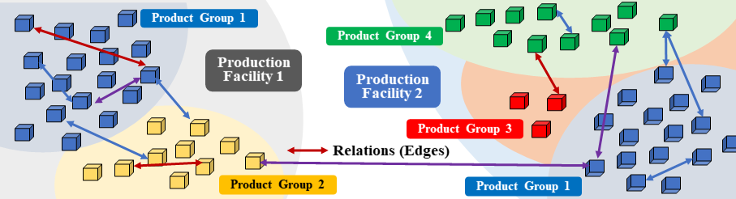

# SupplyGraph: A Benchmark Dataset for Supply Chain Planning using Graph Neural Networks
- Authors: [**Azmine Toushik Wasi**](https://azminewasi.github.io/), [**MD Shafikul Islam**](https://www.linkedin.com/in/md-shafikul-islam-sohan/), and [**Adipto Raihan Akib**](https://www.linkedin.com/in/adipto-raihan-akib-739729117/) 
- Affiliation: [**Computational Intelligence and Operations Lab - CIOL**](https://ciol-sust.github.io/), SUST

---

📌 TL;DR: *This paper introduces a real-world graph dataset empowering researchers to leverage GNNs for supply chain problem-solving, enhancing production planning capabilities, with benchmark scores on six homogeneous graph tasks.*

---

**Abstract:** Graph Neural Networks (GNNs) have gained traction across different domains such as transportation, bio-informatics, language processing, and computer vision. However, there is a noticeable absence of research on applying GNNs to supply chain networks. Supply chain networks are inherently graph-like in structure, making them prime candidates for applying GNN methodologies. This opens up a world of possibilities for optimizing, predicting, and solving even the most complex supply chain problems. A major setback in this approach lies in the absence of real-world benchmark datasets to facilitate the research and resolution of supply chain problems using GNNs. To address the issue, we present a real-world benchmark dataset for temporal tasks, obtained from one of the leading FMCG companies in Bangladesh, focusing on supply chain planning for production purposes. The dataset includes temporal data as node features to enable sales predictions, production planning, and the identification of factory issues. By utilizing this dataset, researchers can employ GNNs to address numerous supply chain problems, thereby advancing the field of supply chain analytics and planning.

---

### Accepted in [4th workshop on Graphs and more Complex structures for Learning and Reasoning (GCLR Workshop)](https://sites.google.com/view/gclr2024/), [AAAI'24 (38th Annual AAAI Conference on Artificial Intelligence)](https://aaai.org/aaai-conference/).

---

---

## Data Collection

We obtained data from the central database system of one of the biggest and most prominent FMCG (Fast Moving Consumer Goods) companies in Bangladesh. We reorganize it for temporal graph utilization, extracting nodes and features. We are unable to publish the actual product names, product codes, and the name of the company, as doing so could potentially compromise the competitive standing of the concerned company. Table \ref{tab:datasets} summarizes the dataset information.

**Quality Control:** Each individual node, edge, and node feature undergoes a thorough manual examination and validation process. This involves scrutinizing the data for any irregularities, such as anomalies or missing information. Additionally, even zero values are meticulously reviewed to ensure their accuracy and legitimacy.

**Feature Description:** In this dataset, **nodes** pertain to distinct products, while **edges** represent various connections linking these products: same product group or sub-group, same plant or storage location.

In the temporal data, node features include production, sales orders, delivery to distributors, and factory issues.

- **Production**: Quantifies product output considering sales orders, customer demand, vehicle fill rate, and delivery urgency. This quantity is typically measured in units or Metric Tons.
- **Sales Order**: Signifies distributor-requested quantities, pending approval from the accounts department. It reflects overall product demand.
- **Delivery to Distributors**: Denotes dispatched products aligning with orders, impacting company revenue significantly.
- **Factory Issue**: It covers total products shipped from manufacturing facilities, with some going to distributors and the rest to storage warehouses. 
